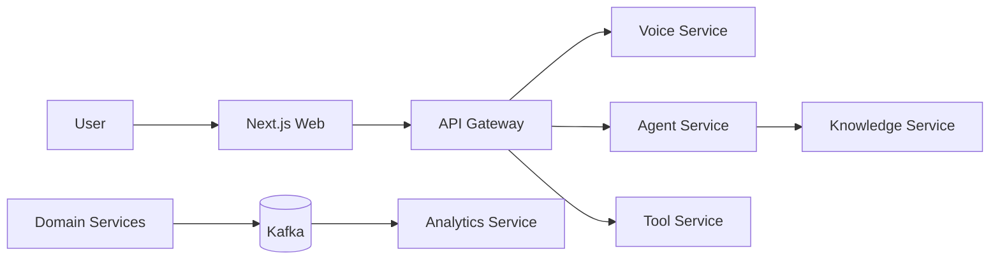
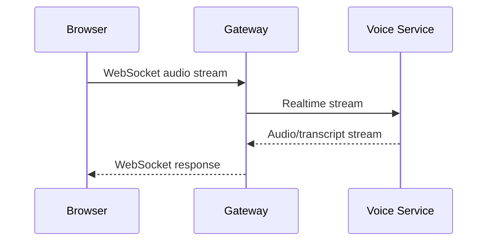
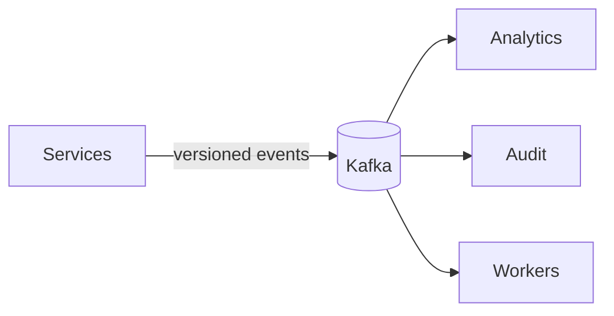
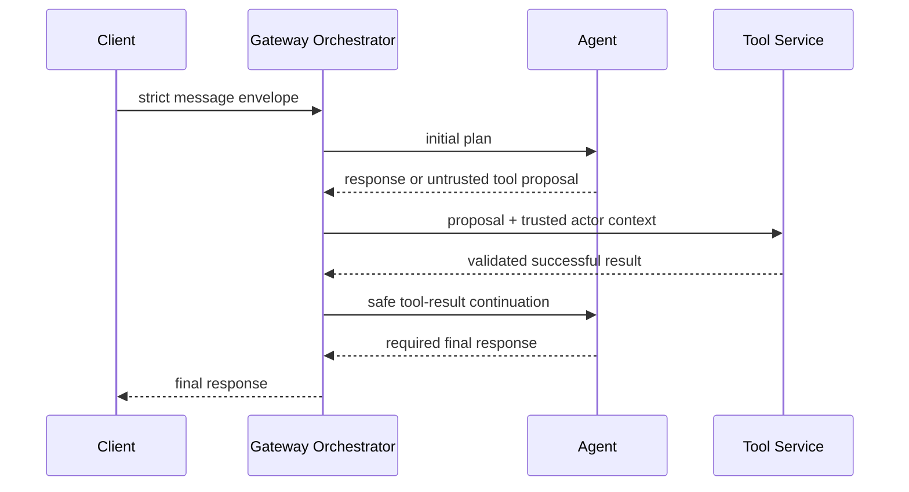
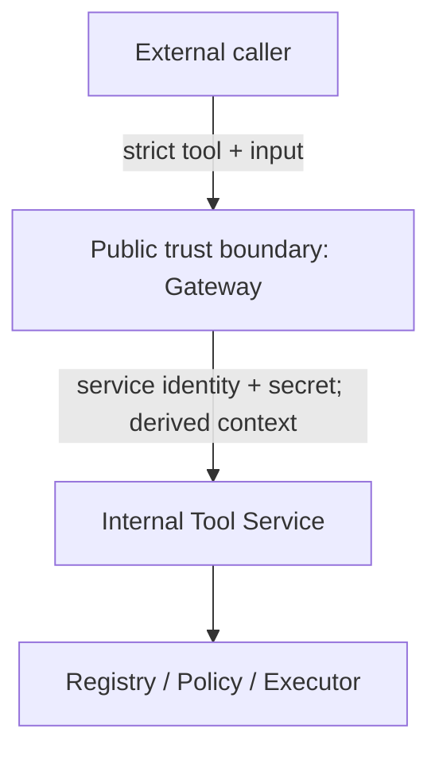
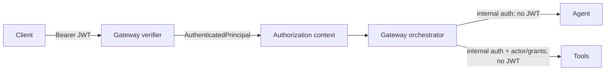
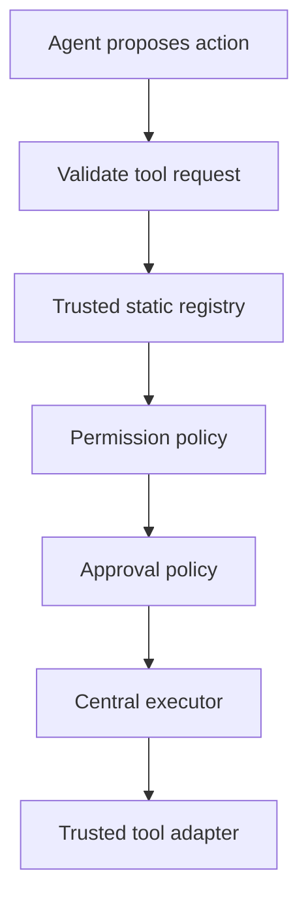

# AURA Architecture

## 1. Goals

AURA aims to become a self-hosted multilingual autonomous voice agent with natural mixed-language conversation, contextual memory, knowledge retrieval, and permission-aware action execution. The system must remain understandable, testable, secure by default, and independently evolvable.

### Implemented

- Phase 1 monorepo and web foundation
- Phase 2 Fastify Gateway runtime with validated configuration, operational endpoints, request correlation, structured logging, security headers, stable external errors, and graceful shutdown
- Phase 3 Tool Service execution foundation with a trusted registry, typed contracts, input validation, permission enforcement, approval policy, and the local `system.echo` tool
- Phase 4 trusted Gateway-to-Tool-Service communication with derived development context, service authentication, correlation propagation, bounded timeout, contract validation, and safe error translation
- Phase 5 Python Agent planning foundation with deterministic intent handling, typed response/tool plans, internal authentication, and a strict Gateway-to-Agent boundary
- Phase 6 deterministic single-tool orchestration with Gateway-owned coordination, successful tool-result continuation, a hard loop limit, and explicit partial-failure semantics
- Phase 7 stateless HS256 authentication with strict claims, immutable principals, server-derived authorization context, and protected application routes

### Planned

AI-backed reasoning, voice, knowledge, analytics, authentication, WebSockets, databases, external tool integrations, and event infrastructure remain architectural direction rather than implemented capability.

## 2. Architectural style

AURA uses a pnpm/Turborepo monorepo containing a Next.js application, future Node.js and Python services, and narrowly scoped shared packages. The intended runtime architecture is service-oriented, but services are introduced only when a real deployable capability requires them. This preserves future independent deployment without paying distributed-systems costs prematurely.

Service communication uses explicit, versionable, runtime-validated contracts. TypeScript boundaries will pair Zod schemas with types; Python boundaries will use Pydantic. Arbitrary unvalidated payloads are not valid service contracts.

## 3. Service boundaries

| Boundary  | Owns                                                                                                                         | Explicitly excludes                                     |
| --------- | ---------------------------------------------------------------------------------------------------------------------------- | ------------------------------------------------------- |
| Web       | User experience and client-side interaction state                                                                            | Authorization decisions and secrets                     |
| Gateway   | Implemented HTTP lifecycle, correlation, errors, trusted clients, and single-tool orchestration; planned sessions/WebSockets | AI inference, audio processing, integrations, retrieval |
| Voice     | Realtime speech/audio transformation and short-lived processing state                                                        | Planning, permissions, and business workflows           |
| Agent     | Implemented deterministic intent, planning, responses, and typed tool proposals; planned AI-backed reasoning                 | Permissions, approvals, OAuth secrets, direct actions   |
| Tools     | Implemented trusted registry and execution policy; planned integrations, credentials, persisted approvals and idempotency    | Agent reasoning and voice processing                    |
| Knowledge | Ingestion, retrieval, embeddings, graph context, memory access                                                               | Privileged actions and broad credential access          |
| Analytics | Derived metrics from asynchronous events                                                                                     | Critical-path processing and transactional truth        |

Services do not receive unrestricted access to every datastore. Each service gains only the data access its responsibility requires, exposed through controlled APIs where another service owns that data.

## 4. Realtime communication

Realtime voice uses a direct, low-latency streaming path:

**Realtime voice: Browser → WebSocket → Gateway → Voice.** Audio must not travel through Kafka. The Gateway owns the external connection lifecycle; Voice owns audio processing.

## 5. Asynchronous communication

Kafka is planned for durable asynchronous domain events such as `conversation.completed`, `tool.execution.requested`, `tool.execution.completed`, and `agent.error`. Events use stable names and versioned schemas. Producers publish facts or requests; independently scalable consumers handle analytics, auditing, and workers.

**Async events: Services → Kafka → Consumers.** Kafka configuration and event implementations are deferred until concrete workflows exist.

## 6. Datastore responsibilities

- **PostgreSQL:** Transactional system of record, including future users, authentication metadata, integration metadata, permissions, action/audit metadata, and conversation metadata.
- **CognoDB:** Graph-oriented context: people, projects, systems, relationships, memories, incidents, and knowledge links.
- **Redis:** Transient sessions, cache, rate-limit state, short-lived voice state, and coordination.

The Agent Service will not directly access OAuth credentials, execute external actions, or receive unrestricted transactional database access. The Tool Service controls sensitive integrations; the Knowledge Service controls graph and retrieval access. Exact table and dataset ownership will be decided with each implemented domain.

## 7. Security, errors, and observability

### Agent orchestration boundary

Agent output is untrusted planning data. It cannot grant permissions, assign risk, approve work, or call Tool Service. Gateway owns orchestration and uses authorization context derived from a verified principal; Tool Service remains authoritative for existence, input, permissions, risk, approval, and execution. TypeScript/Zod and Python/Pydantic independently validate the cross-language contract, backed by a real cross-service contract test.

Phase 6 permits exactly one tool execution. A second tool proposal fails closed because multi-step workflows require explicit iteration budgets, approval state, dependency tracking, idempotency, recovery, and loop detection. State exists only for the request lifetime. There are no retries: if a tool succeeds and final Agent generation fails, Gateway reports that the action may have completed and does not execute it again. Future state-changing workflows require durable idempotency before retry behavior can be considered.

### Tool execution boundary

External callers cannot assign actor identity, permissions, approvals, or internal credentials. Gateway verifies short-lived HS256 tokens, converts their bounded subject and allowlisted grants into an immutable principal, and derives Tool context from that principal. Tool Service authenticates Gateway before accepting context and remains the permission-policy authority.

External JWT signing and internal service authentication are distinct trust domains with separate secrets. Tokens are never forwarded to Agent or Tool Service. Phase 7 has no login endpoint, user store, refresh token, revocation list, or session persistence. HS256 is an interim first-party mechanism intended to migrate to an external identity provider and asymmetric verification later.

The Tool Service is authoritative for tool existence, input schemas, required permissions, risk, approval, and execution. Agent or LLM output cannot override those values. Gateway-derived development identity is not production authentication. Future context must derive from authenticated users and trusted services; approvals must bind actor, exact action, tool, expiry, and approving identity.

Only `system.echo` is currently registered. Real permissions, OAuth, Gmail, Calendar, Jira, GitHub, signed or database-backed approvals, persisted idempotency, and Kafka execution events remain planned.

- **Least privilege:** Every integration and service receives only the permissions it requires.
- **Explicit authorization:** Client state is never authority. Backend code enforces permissions and approval policy.
- **Human approval:** High-risk actions require explicit confirmation before execution.
- **Trust boundary:** LLM output proposes intent and tool calls; trusted code validates, authorizes, and executes them.
- **Auditability:** Important actions will produce durable, tamper-resistant audit records.
- **Secrets:** Keys, OAuth tokens, database credentials, private keys, and provider secrets never enter Git or logs.

Backend services will use structured internal errors, centralized translation to stable external responses, diagnostic context, and correlation/request IDs. Stack traces and internal details must not leak to users.

Structured logs are expected to support `timestamp`, `level`, `service`, `requestId`, `conversationId`, `event`, `duration`, and safe error metadata. Passwords, access tokens, OAuth secrets, and unnecessary sensitive user content must never be logged.

## 8. Deployment model

- **Web:** Next.js on Vercel.
- **Node.js services:** Containers on a VM or managed container platform.
- **Python AI services:** GPU-capable containers or VMs where needed.
- **Datastores:** Managed offerings where their operational and security properties fit.
- **Kafka:** Managed Kafka or dedicated infrastructure.
- **Local development:** Docker Compose in a later milestone.
- **Kubernetes:** Only after scale, availability, or operational requirements justify it.

No container or Kubernetes configuration exists in Phase 1.

## 9. Evolution and testing strategy

Capabilities enter through small milestones: define the contract and ownership, implement the simplest viable path, test it, and then operationalize it. Shared packages stay narrow and are created around demonstrated reuse rather than speculation.

Testing will use four layers:

- **Unit:** Domain and business behavior.
- **Integration:** Service-to-infrastructure boundaries.
- **Contract:** API and event compatibility.
- **End-to-end:** Critical user journeys.

The first executable backend milestone should establish the Gateway's operational skeleton and explicit health/configuration contract without introducing AI, Kafka, databases, or integrations.
