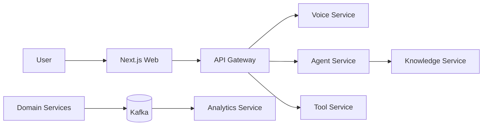
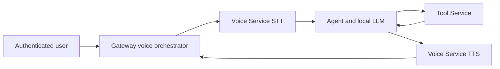
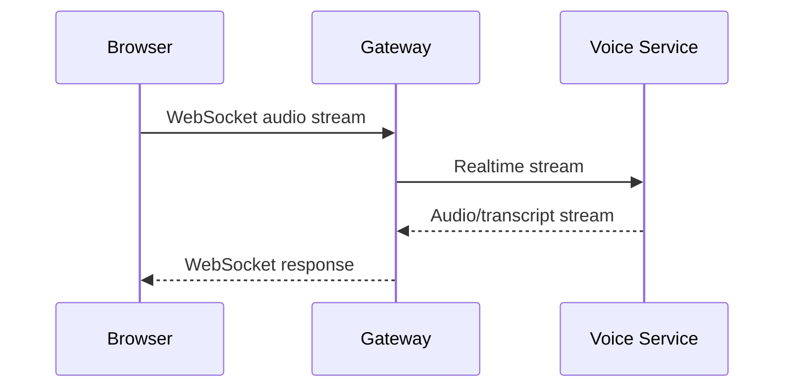
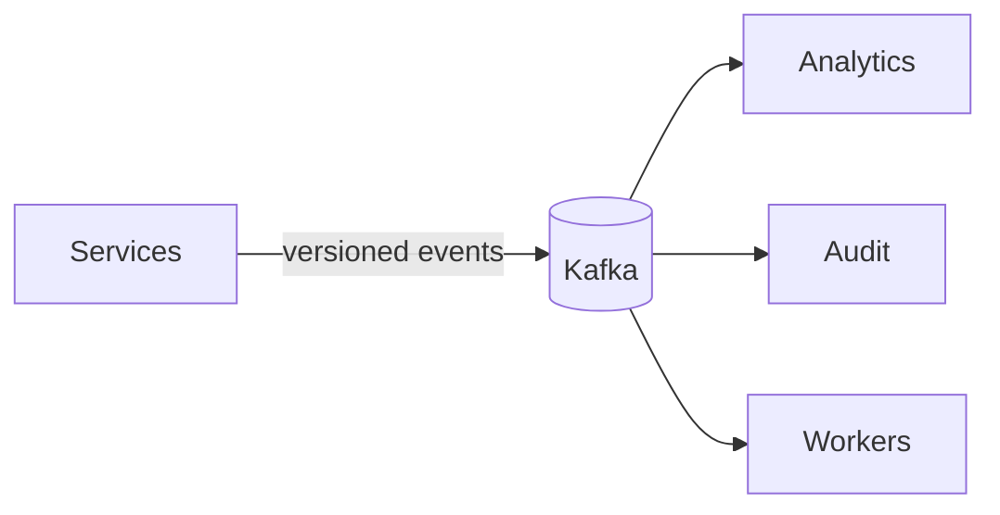
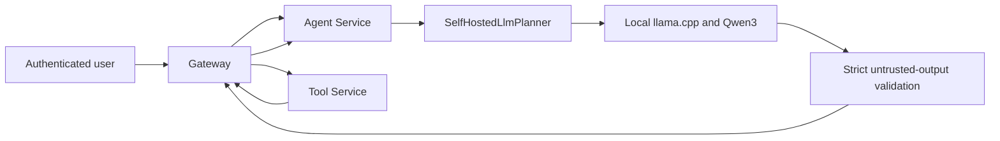
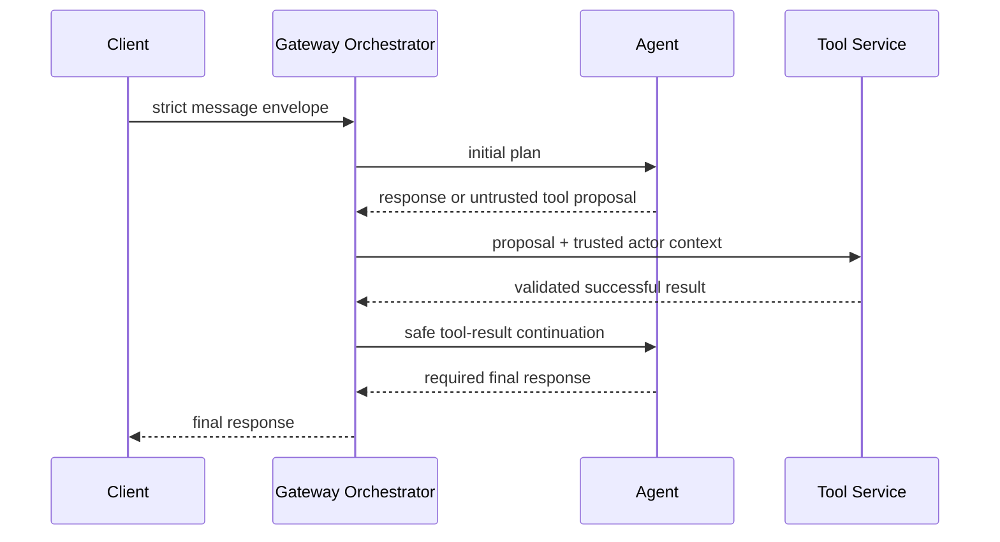
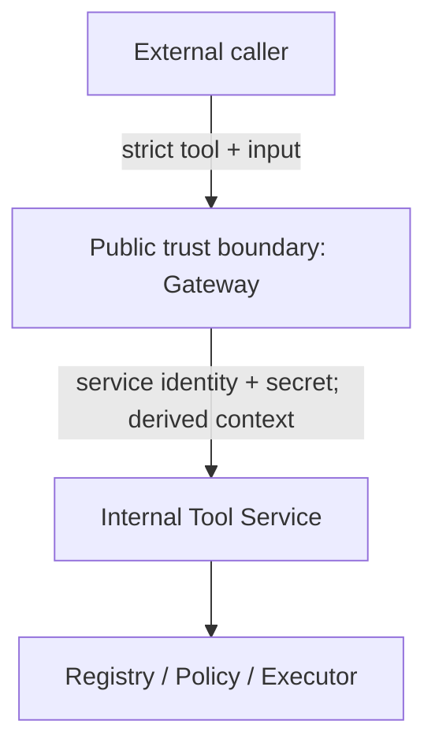
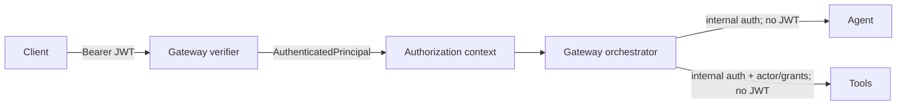
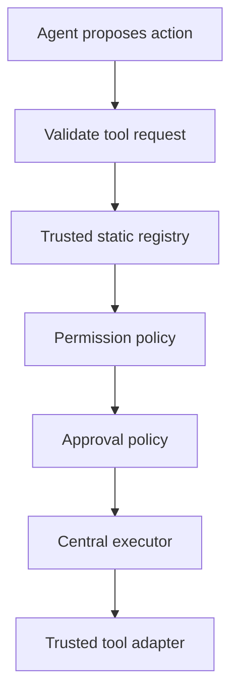

# AURA Architecture

## 1. Goals

AURA aims to become a self-hosted multilingual autonomous voice agent with natural mixed-language conversation, contextual memory, knowledge retrieval, and permission-aware action execution. The system must remain understandable, testable, secure by default, and independently evolvable.

### Implemented

Google Contacts is optional and read-only. Gateway owns encrypted credentials and verifies `contacts.readonly`; Tool Service calls only fixed People API list/get endpoints and exposes bounded names, email addresses, and phone numbers. Raw provider objects, photos, tokens, and Contacts writes remain excluded.

Phase 27 makes Google authorization status visible without conflating it with AURA authentication. Gateway derives a feature-aware capability view from encrypted credential scopes, while the browser sees only stable capability IDs and `granted`/`reauth_required` states. Re-consent reuses the encrypted OIDC transaction, PKCE, state, and nonce, binds it to the authenticated actor, and requires the verified Google subject to match the existing identity. Missing replacement refresh tokens preserve the existing encrypted token.

### V1 — Complete

V1 closes with a sealed 14-tool registry, exact non-wildcard permissions, schema-validated inputs and outputs, one Tool proposal per Agent turn, Gateway-owned orchestration, and Tool-Service-owned policy. Nine read/local tools require no approval; Calendar create/update/delete and Gmail send/reply require persistent exact-action approval and permit at most one provider dispatch. Request IDs correlate browser or voice ingress through Agent, Tool Service, provider adapters, and continuation without becoming authorization material.

V2 execution capabilities remain absent by design. Phase 40 adds bounded proposal-only multi-step planning, but no durable workflow, step execution, schedules, arbitrary network/browser execution, shell/filesystem tools, Drive, or Tasks.

### V1.5 — Complete

V1.5 closes with explicit PostgreSQL-backed user Memory, local pgvector semantic Memory retrieval, bounded manual/TXT/PDF/DOCX Knowledge ingestion, deterministic transactional chunks, best-effort local embeddings with operator backfill, owner-scoped semantic Knowledge retrieval, grounded Agent continuation, Gateway-trusted response-local citations, and authenticated Web management. Memory and Knowledge permissions remain independent, ownership and soft-delete lifecycle are constrained in SQL, and untrusted stored/retrieved content never becomes action or authorization authority.

The completed V1.5 boundary excludes automatic memory extraction or personalization, transcript ingestion, OCR, URL/Drive/attachment ingestion, hybrid search or reranking, background autonomous indexing, workflow execution or persistence, scheduling, and autonomous actions.

- Phase 1 monorepo and web foundation
- Phase 2 Fastify Gateway runtime with validated configuration, operational endpoints, request correlation, structured logging, security headers, stable external errors, and graceful shutdown
- Phase 3 Tool Service execution foundation with a trusted registry, typed contracts, input validation, permission enforcement, approval policy, and the local `system.echo` tool
- Phase 4 trusted Gateway-to-Tool-Service communication with derived development context, service authentication, correlation propagation, bounded timeout, contract validation, and safe error translation
- Phase 5 Python Agent planning foundation with deterministic intent handling, typed response/tool plans, internal authentication, and a strict Gateway-to-Agent boundary
- Phase 6 deterministic single-tool orchestration with Gateway-owned coordination, successful tool-result continuation, a hard loop limit, and explicit partial-failure semantics
- Phase 7 HS256 authentication with strict claims, immutable principals, server-derived authorization context, and protected application routes
- Phase 8 PostgreSQL-backed users, revocable sessions, transactional opaque refresh-token rotation, and per-request session enforcement
- Phase 9 self-hosted llama.cpp/Qwen3 planning with explicit planner modes, constrained JSON generation, strict plan validation, multilingual text handling, and lifecycle-aware readiness
- Phase 10 authenticated turn-based voice orchestration with bounded WAV ingress, local faster-whisper STT, local Piper TTS, correlation propagation, and explicit post-action synthesis failure semantics
- Phase 11 config-driven multilingual Piper voice selection for English, Hindi, experimental Hinglish/Telugu, conservative locale/text normalization, bounded synthesis, WAV validation, and explicit unsupported Kannada behavior
- Phase 12 authenticated `aura.voice.v1` WebSocket ingress with fixed PCM framing, deterministic server-side energy VAD, explicit one-turn state, bounded buffers, correlated lifecycle events, and chunked completed-WAV output
- Phase 13 VAD-driven barge-in with typed execution phases, request-scoped STT/Agent/TTS cancellation, superseded-turn suppression, cancellable audio delivery, and non-retriable Tool settlement sequencing
- Phase 14 browser voice client with AudioWorklet capture, deterministic 16 kHz PCM framing, validated WebSocket events, in-memory transcript state, ordered WAV playback, and authoritative interruption handling
- Phase 15 browser identity lifecycle with HttpOnly refresh cookies, memory-only access tokens, single-flight rotation, conservative authenticated retries, server-controlled development bootstrap, and coordinated voice teardown
- Phase 16 Google OIDC Authorization Code + PKCE account entry with encrypted transient state, nonce validation, durable provider-subject binding, and AURA-owned session issuance

### Planned

True streaming STT/TTS, partial transcripts, full-duplex overlap, analytics, additional credential providers, external tool integrations, and event infrastructure remain architectural direction rather than implemented capability. Memory and bounded Knowledge/RAG are implemented through V1.5.

### Safe interruption boundary

Phase 13 treats interruption as turn supersession, not transaction rollback. STT, initial Agent planning, Agent finalization, TTS, and unsent audio are request-scoped and cancellable. A Tool request becomes committed at dispatch: it receives no user-cancellation signal, is never retried, and must reach a known terminal result before a buffered replacement turn can execute. A late successful action may emit `turn.action_completed_after_interrupt` without result data; stale Agent, TTS, audio-completion, and turn-completion events remain suppressed.

The session accepts bounded PCM while old work settles. Validated speech moves the user-facing state through `INTERRUPTING` into `LISTENING`; silence and sub-threshold noise do not interrupt. Disconnect aborts only safe dependencies and audio delivery. Tool transport ambiguity remains authoritative and non-retriable.

### Browser voice boundary

The web client owns microphone permission UX, local resampling/framing, connection lifecycle, ephemeral playback, and presentation state. It does not decide interruption authority, actor identity, permissions, Tool state, or orchestration. Incoming control events are untrusted and runtime validated; binary audio is associated only with the current server-declared turn.

Because browser WebSocket APIs cannot set `Authorization`, the existing access JWT is carried in a bounded `aura.jwt.*` WebSocket subprotocol while `aura.voice.v1` is the only negotiated protocol. Gateway extracts it into the existing verifier and redacts the credential-bearing header. Production deployments require TLS/WSS. This compatibility mechanism does not change normal HTTP bearer authentication.

Browser refresh tokens are rotating opaque credentials stored only in an `HttpOnly`, `SameSite=Strict` cookie scoped to `/api/v1/auth`; production cookies are also `Secure`. The web application keeps the current access JWT in process memory and bootstraps by refreshing once before rendering authenticated UI. Cookie-backed mutations require the exact configured web `Origin`, and credentialed CORS allows only that origin. Concurrent refresh demand shares one request. Only safe HTTP methods may be retried once after refresh; action POSTs are never automatically replayed. Logout revokes the persisted session, expires the cookie, clears memory, and unmounts the voice runtime.

### Production account entry

Google authenticates the person, but Google credentials never become AURA application credentials. Gateway uses `openid-client` discovery and Authorization Code + S256 PKCE with `state`, `nonce`, exact client/redirect configuration, and only `openid email profile`. It consumes the validated ID-token claims at a narrow adapter boundary and discards provider access tokens; offline access is not requested.

The PKCE verifier, state, nonce, and issue time live for at most ten minutes in an AES-256-GCM encrypted `HttpOnly`, `SameSite=Lax` transaction cookie scoped to the callback. `Lax` is required for Google's cross-site top-level callback; the normal AURA refresh cookie remains `Strict`. Callback completion clears the transaction cookie on success and failure and redirects only to `WEB_APP_ORIGIN` with an allowlisted non-sensitive result.

`external_identities(provider, provider_subject)` is unique and binds Google `sub` to one AURA user. Email is stored only as optional verified link-time metadata and is never an account key or implicit linking mechanism. First login creates the user and binding in one transaction; unique-conflict recovery resolves concurrent first login without duplicate identities or orphaned users. A fresh normal AURA session is then created through `SessionService`.

## 2. Architectural style

AURA uses a pnpm/Turborepo monorepo containing a Next.js application, future Node.js and Python services, and narrowly scoped shared packages. The intended runtime architecture is service-oriented, but services are introduced only when a real deployable capability requires them. This preserves future independent deployment without paying distributed-systems costs prematurely.

Service communication uses explicit, versionable, runtime-validated contracts. TypeScript boundaries will pair Zod schemas with types; Python boundaries will use Pydantic. Arbitrary unvalidated payloads are not valid service contracts.

## 3. Service boundaries

| Boundary  | Owns                                                                                                                                              | Explicitly excludes                                     |
| --------- | ------------------------------------------------------------------------------------------------------------------------------------------------- | ------------------------------------------------------- |
| Web       | User experience and client-side interaction state                                                                                                 | Authorization decisions and secrets                     |
| Gateway   | Implemented HTTP lifecycle, OIDC account entry, identity/session persistence, correlation, errors, trusted clients, and single-tool orchestration | AI inference, audio processing, integrations, retrieval |
| Voice     | Realtime speech/audio transformation and short-lived processing state                                                                             | Planning, permissions, and business workflows           |
| Agent     | Implemented deterministic and self-hosted LLM planning with strictly validated response/tool proposals                                            | Permissions, approvals, OAuth secrets, direct actions   |
| Tools     | Implemented trusted registry and execution policy; planned integrations, credentials, persisted approvals and idempotency                         | Agent reasoning and voice processing                    |
| Knowledge | Ingestion, retrieval, embeddings, graph context, memory access                                                                                    | Privileged actions and broad credential access          |
| Analytics | Derived metrics from asynchronous events                                                                                                          | Critical-path processing and transactional truth        |

Services do not receive unrestricted access to every datastore. Each service gains only the data access its responsibility requires, exposed through controlled APIs where another service owns that data.

## 4. Realtime communication

Phase 12 adds a realtime transport and server-detected turn boundary over the existing whole-turn processing pipeline:

Voice transforms speech only. Gateway authenticates the user, derives authority, owns orchestration, and preserves correlated request IDs across Voice, Agent, and Tools. The multipart/JSON API remains a compatibility path. WebSocket input is realtime framed PCM, but STT/TTS remain completed-turn calls and output is a chunked completed WAV; partial transcripts and streaming synthesis are not implemented.

Realtime voice uses a direct, low-latency streaming path:

**Realtime voice: Browser → WebSocket → Gateway → Voice.** Audio must not travel through Kafka. The Gateway owns the external connection lifecycle; Voice owns audio processing.

## 5. Asynchronous communication

Kafka is planned for durable asynchronous domain events such as `conversation.completed`, `tool.execution.requested`, `tool.execution.completed`, and `agent.error`. Events use stable names and versioned schemas. Producers publish facts or requests; independently scalable consumers handle analytics, auditing, and workers.

**Async events: Services → Kafka → Consumers.** Kafka configuration and event implementations are deferred until concrete workflows exist.

## 6. Datastore responsibilities

- **PostgreSQL:** Transactional system of record for users, sessions, provider credentials, approvals, and actor-owned explicit memories.
- **CognoDB:** Graph-oriented context: people, projects, systems, relationships, memories, incidents, and knowledge links.
- **Redis:** Transient sessions, cache, rate-limit state, short-lived voice state, and coordination.

The Agent Service will not directly access OAuth credentials, execute external actions, or receive unrestricted transactional database access. The Tool Service controls sensitive integrations; the Knowledge Service controls graph and retrieval access. Exact table and dataset ownership will be decided with each implemented domain.

### V1.5 Phases 29–30: persistent and explicit memory

`user_memories` stores manually submitted user data under a PostgreSQL foreign key to `users`. Its deliberately small kinds are `preference`, `fact`, `instruction`, and `note`; the only public source is the server-assigned `user_explicit`. Normal reads require `ACTIVE` status and direct `(actor_id, id)` ownership predicates. Deletion is an atomic owner-scoped transition to `DELETED` with a timestamp, and deleted or cross-owner identifiers both resolve as `MEMORY_NOT_FOUND`.

Gateway exposes bounded authenticated CRUD at `/api/v1/memories`. `memory.read` and `memory.write` are independent exact permissions, caller-supplied ownership/lifecycle/source fields fail strict validation, list results are bounded and newest-first, and content is limited to 4096 characters. Memory content is never logged.

Phase 30 adds a distinct strict Agent plan union for explicit memory read/create/delete. Gateway—not the Agent—checks `memory.read` or `memory.write`, derives ownership, calls the shared MemoryService, and returns a dedicated sanitized continuation result. Reads are intentional, newest-first, and capped at 10; creates require explicit remember/save language; deletes require an exact UUID. One turn may contain only one response, Tool, or memory action.

Memory context is untrusted persisted user content, structurally separated from system policy and never treated as authorization or executable instruction. Voice can carry a finalized explicit request through the same path, but background, stale, and interrupted transcripts are not persisted. Tool Service and its 14-tool registry are unchanged. Through Phase 30, transcript scanning, automatic profiling/extraction, fuzzy deletion, prompt injection as authority, embeddings, semantic retrieval, vector storage, document ingestion, and RAG were absent.

### V1.5 Phase 31: semantic memory retrieval

Gateway owns a narrow local embedding client and a dedicated pgvector repository. A fixed 384-dimensional embedding model is provisioned outside the repository and served through a separately managed OpenAI-compatible `/v1/embeddings` endpoint; browser, Voice, Agent, and request bodies cannot select the host or model. Memory creation is durable even when embedding is unavailable, while an explicit bounded backfill handles active rows missing the current model.

The database ranks with cosine distance only within `actor_id = authenticated actor`, `status = ACTIVE`, and configured-model predicates. Results are thresholded, top-k bounded, and stripped to `id`, `kind`, and `content`. `memory_search` is a distinct one-action Agent proposal used only when the user explicitly asks about particular saved information. Retrieved content remains untrusted and cannot authorize Tools or override policy. There is still no document ingestion, chunking, citations, automatic personalization, or general RAG.

### V1.5 Phase 32: knowledge ingestion foundation

Gateway exposes explicit authenticated manual-text CRUD at `/api/v1/knowledge/documents`. `knowledge.read` and `knowledge.write` remain independent, ownership comes only from the verified principal, and repository predicates combine document ID, actor ID, and `ACTIVE` lifecycle. Foreign-owned, missing, and deleted identifiers share `KNOWLEDGE_NOT_FOUND` semantics.

Creation accepts only title and plaintext content. Gateway normalizes CRLF/CR to LF, trims boundary whitespace, rejects unsafe controls and content above 128 KiB UTF-8, and computes SHA-256 over the normalized document. Deterministic paragraph-aware chunking targets 1,200 characters with a 2,000-character hard maximum, zero-based ordinals, no overlap, and at most 128 chunks. PostgreSQL inserts `knowledge_documents` and its complete `knowledge_chunks` set in one transaction; any chunk failure rolls back the document.

Deletion is a soft transition to `DELETED`. Chunks remain stored but internal access always joins through the owner-scoped active document, making deleted chunks unavailable immediately. Public lists expose metadata only and explicit get returns bounded normalized content, never raw chunks or hashes. Logging contains request IDs, operation, document ID, byte length, chunk count, and outcome only—not title, content, chunks, hashes, or request bodies.

Knowledge remains isolated from Agent, Tool Service, and Voice. The production registry stays at 14 tools. Phase 32 provides no file/multipart, PDF/DOCX, URL, provider, automatic ingestion, document embeddings, semantic document retrieval, citations, or RAG answers.

### V1.5 Phase 33: knowledge chunk embedding foundation

After the Phase 32 document/chunk transaction commits, Gateway best-effort embeds each chunk through the existing fixed local OpenAI-compatible runtime. A bounded worker pool of two prevents ingestion from creating unbounded model load. Valid 384-dimensional finite vectors are upserted into `knowledge_chunk_embeddings`, uniquely keyed by chunk and model; different configured model identifiers can coexist. Embedding failure never rolls back or misreports the stored document, successful chunks remain indexed after partial failure, and there is no automatic retry.

The operator-only `knowledge:backfill` command processes at most 100 missing chunks per invocation in deterministic order. Its SQL selection joins through `ACTIVE` documents and excludes existing rows for the current model, so deleted documents are never indexed. Chunk text, vectors, request/response bodies, and model endpoints are not logged or exposed through HTTP. The Phase 32 public API is unchanged, and Phase 33 deliberately adds no cosine search, knowledge Agent plan, retrieval context, citations, or RAG response generation.

### V1.5 Phase 34: semantic knowledge retrieval foundation

Authenticated callers with exact `knowledge.read` permission may explicitly call `POST /api/v1/knowledge/search` with only a bounded query string. Gateway trims and validates the query, embeds it with the fixed current model, and issues one parameterized pgvector cosine query. The SQL candidate set itself joins embeddings to chunks and documents while enforcing actor ownership, `ACTIVE` lifecycle, current model, minimum similarity, deterministic tie ordering, and the configured limit. There is no global nearest-neighbor pool or application-side ownership filtering.

Cosine similarity is `1 - (embedding <=> query_vector)`. `KNOWLEDGE_SEARCH_LIMIT` is server-controlled from 1–10 (default 5), while `KNOWLEDGE_SEARCH_MIN_SIMILARITY` is constrained to -1–1 (default 0.5). Public results contain document ID, chunk ID, title, bounded chunk content, and ordinal only. Queries, titles, chunks, vectors, and scores are excluded from logs; unembedded or nonqualifying chunks produce an empty result without fallback. This remains a retrieval API only: Agent, Tool Service, and Voice contracts are unchanged, with no automatic retrieval, RAG answer, citation, or full-document synthesis.

## 7. Security, errors, and observability

### Agent orchestration boundary

The model receives only bounded planning input and safe tool-result data—never JWTs, session or refresh tokens, internal service tokens, database credentials, actors, permissions, risk, or approval state. The versioned system prompt and structured-output grammar reduce prompt-injection and format risk but do not claim immunity. User and tool-result content remain untrusted data. Unknown tools and extra privileged fields fail validation.

**LLM proposes. Gateway orchestrates. Tool Service authorizes and executes.** The local inference process loads the model once and is consumed over loopback HTTP; Agent does not spawn it from request handlers. Deterministic mode remains the safe CI fallback only when explicitly configured, while selected LLM mode fails closed if its runtime is unavailable.

Agent output is untrusted planning data. It cannot grant permissions, assign risk, approve work, or call Tool Service. Gateway owns orchestration and uses authorization context derived from a verified principal; Tool Service remains authoritative for existence, input, permissions, risk, approval, and execution. TypeScript/Zod and Python/Pydantic independently validate the cross-language contract, backed by a real cross-service contract test.

Phase 6 permits exactly one tool execution. A second tool proposal fails closed because multi-step workflows require explicit iteration budgets, approval state, dependency tracking, idempotency, recovery, and loop detection. State exists only for the request lifetime. There are no retries: if a tool succeeds and final Agent generation fails, Gateway reports that the action may have completed and does not execute it again. Future state-changing workflows require durable idempotency before retry behavior can be considered.

### Tool execution boundary

External callers cannot assign actor identity, permissions, approvals, or internal credentials. Gateway verifies short-lived HS256 tokens, converts their bounded subject and allowlisted grants into an immutable principal, and derives Tool context from that principal. Tool Service authenticates Gateway before accepting context and remains the permission-policy authority.

External JWT signing and internal service authentication are distinct trust domains with separate secrets. Tokens are never forwarded to Agent or Tool Service. Phase 8 stores users, sessions, and SHA-256 refresh-token digests in PostgreSQL. Access JWTs carry persisted user `sub` and session `sid`; cryptographic validation is followed by a session/user-state lookup on every protected request, so logout, revocation, and user disable take effect immediately. Refresh rotation uses a transaction and row lock, preserves absolute session expiry, and revokes the session family when rotated evidence is replayed. HS256 remains an interim first-party mechanism intended to migrate to an external identity provider and asymmetric verification later.

Identity persistence establishes who the caller is and whether its session remains active. It does not grant tool authority: the fixed Phase 8 `system.echo` permission becomes immutable authorization context, while Tool Service remains authoritative for tool-specific permission and approval policy. A future Redis cache may reduce the per-request PostgreSQL lookup, but Redis is not part of this milestone.

The Tool Service is authoritative for tool existence, input schemas, required permissions, risk, approval, and execution. Agent or LLM output cannot override those values. Gateway-derived development identity is not production authentication. Future context must derive from authenticated users and trusted services; approvals must bind actor, exact action, tool, expiry, and approving identity.

The production registry contains three local tools, five Calendar tools, four Gmail tools, and two read-only Contacts tools. Tool Service remains authoritative for schemas and exact permissions; Google credentials remain Gateway-owned. Gmail send/reply reuse the persistent approval boundary and never retry. Contacts writes, Drive, additional providers, persisted idempotency, and Kafka execution events remain planned.

- **Least privilege:** Every integration and service receives only the permissions it requires.
- **Explicit authorization:** Client state is never authority. Backend code enforces permissions and approval policy.
- **Human approval:** High-risk actions require explicit confirmation before execution.
- **Trust boundary:** LLM output proposes intent and tool calls; trusted code validates, authorizes, and executes them.
- **Auditability:** Important actions will produce durable, tamper-resistant audit records.
- **Secrets:** Keys, OAuth tokens, database credentials, private keys, and provider secrets never enter Git or logs.

Backend services will use structured internal errors, centralized translation to stable external responses, diagnostic context, and correlation/request IDs. Stack traces and internal details must not leak to users.

Structured logs are expected to support `timestamp`, `level`, `service`, `requestId`, `conversationId`, `event`, `duration`, and safe error metadata. Passwords, access tokens, OAuth secrets, and unnecessary sensitive user content must never be logged.

## 8. Deployment model

Phase 17 implements a containerized production foundation. Caddy is the only public network boundary and terminates HTTPS/WSS before routing `/api`, `/health`, and `/ready` to Gateway and all other paths to Next.js. PostgreSQL, Gateway, Tools, Agent, and Voice share a fixed private Compose subnet and publish no host ports. Gateway trusts forwarded client information only from that explicit subnet.

Application images use non-root runtime users and contain no secrets or model weights. PostgreSQL data and Caddy state use named volumes; Voice weights are an external read-only mount. Drizzle migration is a one-shot dependency that completes before Gateway starts. Gateway readiness proves database connectivity but does not apply schema changes.

llama.cpp remains separately managed because CPU/GPU binaries, accelerators, and large model lifecycle are host-specific. Agent consumes its private HTTP endpoint and never owns or kills the process. Deterministic Agent mode supports deployment smoke tests without expensive inference.

The Compose topology is a production-like validation target, not a high-availability control plane. Real production requires protected secret injection, trusted DNS, public certificates, backups, monitoring, capacity limits, and an orchestrator appropriate to measured requirements. Kubernetes remains deferred.

## 9. Evolution and testing strategy

### Phase 36 authenticated Memory and Knowledge UX

The Web application adds thin, schema-validating Memory and Knowledge API clients on top of the existing authenticated-fetch/session boundary. Sensitive user data is held only in component-local state. Neither request bodies nor frontend state can supply actor, permission, lifecycle, source, model, vector, hash, threshold, or server retrieval limit. Mutations require explicit form submission; deletion requires a second confirmation action; pending state suppresses duplicate dispatch.

Memory management covers owned active list/create/delete with optional exact-kind filtering. Knowledge management covers metadata list, manual plaintext create, explicit full-document get, delete, and semantic search. The browser performs no normalization, chunking, hashing, embedding, or ranking. Server errors are reduced to bounded user-facing messages, while unknown failures remain generic.

### V1.5 Phase 37: secure knowledge file ingestion

Authenticated users with exact `knowledge.write` may explicitly upload one TXT, PDF, or DOCX file to `/api/v1/knowledge/files`. Multipart handling is bounded to one `file` part and 10 MiB. Extension and media type are advisory layers backed by content checks: TXT must be valid non-binary UTF-8, PDF must carry the PDF signature and yields text only, and DOCX must be a bounded Word Open XML ZIP with required package entries. The browser cannot supply actor, title, source, lifecycle, chunk, hash, vector, model, or path authority.

PDF processing does not render, run actions, extract attachments, fetch links, or perform OCR. DOCX processing remains in memory, reads only `word/document.xml`, rejects traversal, macros/unsupported extensions, excessive entries, oversized expansion, and compression-bomb ratios, and never extracts embedded files. Original binaries and filenames are neither persisted nor logged.

Extraction precedes persistence, so invalid input creates no document. Valid extracted text enters the existing `KnowledgeService`: normalization, hashing, deterministic chunks, and document/chunk writes remain one transaction; embeddings remain post-commit best effort. Consequently existing backfill, cosine retrieval, Agent grounding, and trusted citations work without file-specific search or RAG paths. URL/Drive/attachment ingestion, scanned-PDF OCR, automatic ingestion, and autonomy remain outside Phase 37.

### V1.5 Phase 38: security and reliability hardening

The release-candidate audit confirms ownership and lifecycle filtering inside Memory/Knowledge SQL queries, exact independent permissions, final-response-only continuation, Gateway-derived response-local citations, non-replayable browser mutations, and inert retained rows after soft deletion. Model, vector, actor, threshold, lifecycle, permission, and citation metadata remain server-controlled.

Hardening closes three concrete boundary gaps: every Agent plan variant now rejects unknown fields; embedding response streams stop at the configured body ceiling instead of buffering an unbounded chunked response; and DOCX validation rejects duplicate critical package entries, macro-enabled content types, external root document relationships, and unsafe declarations. Retrieved and uploaded content remains untrusted evidence, React renders it as text, and sensitive content/query/vector/response values remain outside logs and browser persistence.

### V2 boundary

V2 begins in Phase 40 with a strict proposal-only workflow plan. Agent may propose one to eight steps of kind `tool`, `memory_read`, `memory_search`, or `knowledge_search`; dependencies express ordering only. Every nested object rejects unknown fields, and neither Agent nor caller can provide actor, permissions, approval proof, provider credentials, retry/timeout/idempotency policy, runtime status, results, or timestamps.

Gateway validates unique narrow IDs, dependency existence, self/duplicate dependencies, cycles, and bounds, then returns a deterministic topologically ordered safe proposal. It performs no Tool preparation/execution, approval creation, Memory operation, Knowledge search, provider resolution, or persistence. Runtime-owned workflow and step status types reserve a future policy seam but are absent from the Agent contract and database.

Later V2 phases may add persisted workflow/step state, dependency-aware execution, pause/resume and recovery, idempotency, workflow approvals, bounded autonomy policy, and management UI. Phase 40 adds no workflow API, substitution/JSONPath/template language, scheduler, worker, retry engine, autonomous loop, or execution authority.

Phase 41 adds the first durable runtime-owned state without adding execution. `workflows`, `workflow_steps`, and `workflow_step_dependencies` store one actor-owned validated graph in a single PostgreSQL transaction. Gateway generates UUIDs, ordinals, timestamps, and statuses; roots begin `READY`, dependent steps begin `BLOCKED`, and the workflow begins `READY`. Composite dependency foreign keys ensure both endpoints belong to the same workflow.

`workflow.read` and `workflow.write` are independent exact permissions. Owner-scoped bounded list/detail routes and an idempotent cancellation route expose only safe plan-local step keys and payloads. Cancellation atomically changes `READY → CANCELLED` and cancels all `READY`/`BLOCKED` steps. Foreign and missing IDs share `WORKFLOW_NOT_FOUND`. No route accepts actor or runtime state, and no workflow operation dispatches Tools, providers, approvals, Memory, Knowledge, embeddings, or Agent continuation.

Phase 42 introduces explicit synchronous execution only. PostgreSQL compare-and-set transitions claim a `READY` workflow and the lowest-ordinal `READY` step; concurrent runs cannot create a second attempt or dispatch the same claim. Successful steps unlock only blocked children whose complete dependency set is `SUCCEEDED`. Failure marks remaining unstarted steps `SKIPPED`; completion requires every step to succeed.

Tool steps reuse Tool Service preparation, native permissions, provider resolution, and exact approvals. Memory and Knowledge steps call their existing owner-scoped services and require their native read permissions. Results are recursively stripped of credential/vector fields and capped at 64 KiB. No output affects downstream payloads. Execution is never started at startup, by Voice, by a scheduler, or in the background; stuck `RUNNING` recovery is deliberately deferred.

The responsive product navigation keeps Voice and Google capability management intact. Citation presentation consumes only Gateway-validated structured metadata and never parses answer text for source authority. Contents, drafts, queries, and results are not placed in persistent browser storage, URLs, analytics, or logs. No backend schema or authority boundary changes in this phase.

### Phase 35 grounded knowledge answers

An explicit saved-knowledge question may produce exactly one `knowledge_search` proposal. Gateway—not Agent—derives the actor and `knowledge.read` permission and invokes `KnowledgeService.searchOwned` directly, preserving Phase 34's SQL-level actor, `ACTIVE` lifecycle, configured-model, threshold, and top-k controls. Public search security is unchanged and the Tool registry remains sealed at 14 tools.

Gateway converts deterministic ranked chunks into response-local `K1` through `K10` references and caps aggregate title/content context at 16,000 Unicode characters, retaining higher-ranked evidence first. Agent receives no vectors, similarity, model, ownership, lifecycle, hashes, permissions, or database metadata. The grounded continuation schema accepts only a final response and bounded citation IDs; it cannot return another Tool, memory action, OAuth/approval action, or recursive retrieval.

Citation metadata is trusted because Gateway maps model-supplied reference IDs back to the retrieved document/chunk records. Unknown IDs cause `KNOWLEDGE_GROUNDING_FAILED`; duplicates are normalized in source order. Empty retrieval bypasses continuation and returns a truthful no-match response with no citations. Retrieved content is explicitly untrusted evidence and cannot act as instructions or authorization. Knowledge queries, source content/titles, generated answers, vectors, and scores remain outside logs; only correlation and count/duration metadata are recorded.

Phase 18 establishes the V1 Tool Platform boundary. Tool Service owns statically registered immutable definitions and centrally enforces identifier/version resolution, enabled state, permissions, risk/approval policy, strict input validation, bounded one-shot execution, and output validation. Normalized results are versioned and failures never expose implementation exceptions.

The Agent-facing catalog contains only capability data: name, description, category, and input schema. It excludes actor identity, granted permissions, risk, approval, timeout, and implementation details. Gateway continues to derive trusted authorization context and orchestrate a single proposed tool.

Phase 19 proves the boundary with exactly three local version 1 implementations: `system.echo`, `utility.calculator`, and `utility.datetime`. Calculator parses a deliberately small arithmetic grammar without dynamic execution. Datetime reads server time for an explicit IANA timezone and performs no location inference or network access. Approval persistence, durable idempotency, external integrations, and multi-step planning remain planned.

Phase 20 introduces the approval lifecycle `PENDING → CONSUMED` or `PENDING → REJECTED`, with expiration enforced by PostgreSQL conditional updates. A REQUIRED Agent proposal is prepared against Tool Service metadata, persisted with its exact validated action and trusted Agent continuation request, and returned as an `approval_required` orchestration result without execution. Gateway owns records and decisions; Tool Service independently verifies an internal proof against its authoritative policy and canonical action digest. Explicit approval consumes once, executes the stored action, and passes only the normal Tool result through Agent continuation. Consumption is conservative: once reserved for dispatch it is never reusable, and ambiguous downstream outcomes are never retried.

Realtime voice emits `approval.required` and enters `AWAITING_APPROVAL`. Incoming PCM receives `VOICE_APPROVAL_PENDING`; speech, transcript text, disconnect, and reconnect have no decision authority. An active socket is notified after the authenticated HTTP decision, allowing approved Agent output to proceed through TTS or rejection to settle safely. The notifier is ephemeral while the approval record remains durable.

Calendar authorization remains separate at both layers. AURA requires exact `calendar.events.read` or `calendar.events.write` permissions; Google consent requests the official `calendar.readonly` and `calendar.events` scopes when `GOOGLE_CALENDAR_ENABLED=true`. Existing read-only credentials fail with `PROVIDER_REAUTH_REQUIRED` until re-consented. The stable Google `sub` remains the binding key. Gateway AES-256-GCM encrypts the refresh credential and attaches a bounded access token only to the authenticated Gateway→Tool context.

Gmail is independently gated by `GOOGLE_GMAIL_ENABLED`. It requests only `gmail.readonly` and `gmail.send`; Tool Service requires exact `gmail.messages.read` or `gmail.messages.send`. Gateway verifies the operation-specific scope before forwarding an ephemeral access token during execution. The adapter is fixed to `gmail.googleapis.com/gmail/v1/users/me/messages`. List/get normalize bounded metadata; send builds audited plain-text MIME; reply derives recipient, Message-ID, references, subject, and thread from a trusted metadata GET. Send/reply are approval-required, non-idempotent, single-dispatch operations with no retries; a lost provider response is an ambiguous terminal outcome. Provider tokens, raw MIME, arbitrary headers, attachments, and raw responses never enter Agent, Web, Voice, ToolResult, or logs.

Google capability management is browser-mediated and is not an Agent Tool. `GET /api/v1/integrations/google` returns only enabled capability IDs and safe state. Authenticated reconnect and disconnect mutations require the exact web Origin. Local disconnect removes the provider credential without ending the AURA session or removing its stable identity binding. `PROVIDER_REAUTH_REQUIRED` never triggers automatic navigation, OAuth, Tool retry, approval reopening, or microphone replay; the user reconnects and deliberately starts a new request. Voice can explain that browser action is required but cannot mutate integration state.

Calendar mutations are `calendar.events.create`, `update`, and `delete`. Create/update are trusted `WRITE`; delete is `DESTRUCTIVE`; all are `REQUIRED` approval, `NON_IDEMPOTENT`, and require exact `calendar.events.write`. Update PATCHes only requested allowlisted fields; delete accepts only a bounded event ID. Tool Service derives unmistakable previews and fixed primary-calendar POST/PATCH/DELETE requests. Gateway persists the exact action digest; only explicit authenticated browser approval consumes it and permits one dispatch. Preparation, approval reads, voice phrases, rejection, expiry, and card rendering cannot mutate Google. A lost mutation response is ambiguous and is never retried. Attendees, recurrence, conferencing, descriptions, additional calendars, and ACL operations are not implemented.

Capabilities enter through small milestones: define the contract and ownership, implement the simplest viable path, test it, and then operationalize it. Shared packages stay narrow and are created around demonstrated reuse rather than speculation.

Testing will use four layers:

- **Unit:** Domain and business behavior.
- **Integration:** Service-to-infrastructure boundaries.
- **Contract:** API and event compatibility.
- **End-to-end:** Critical user journeys.

The first executable backend milestone should establish the Gateway's operational skeleton and explicit health/configuration contract without introducing AI, Kafka, databases, or integrations.
